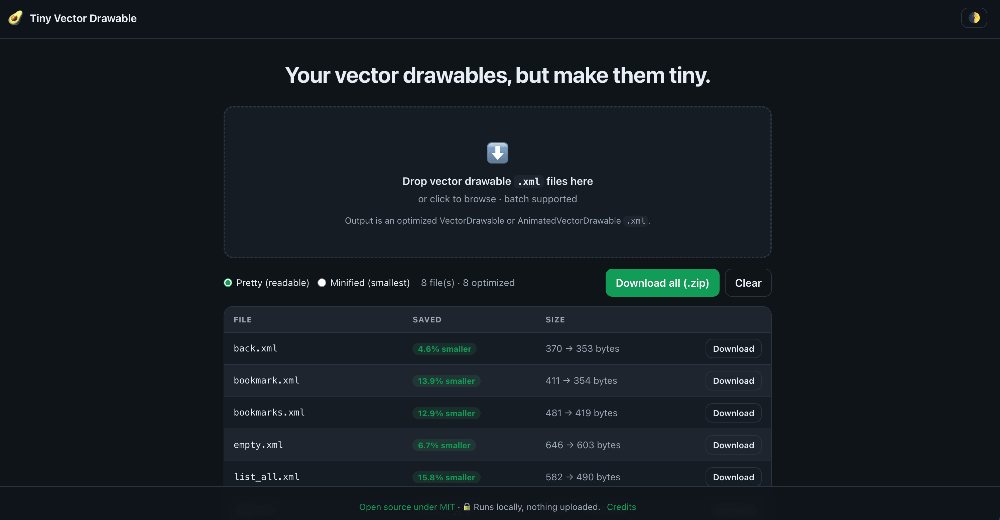

# Tiny Vector Drawable

_Your vector drawables, but make them tiny._

Shrink Android VectorDrawable and AnimatedVectorDrawable XML right in your
browser. Drop an `.xml` file, get an optimized one back, download it. Nothing
gets uploaded.

Uses [avocado](https://github.com/alexjlockwood/avocado) by Alex Lockwood,
compiled for the browser. Visual result stays the same. Just smaller and faster
to parse.

## Use it

1. Open the site (GitHub Pages, or run it locally).
2. Drag `.xml` vector drawable files onto the drop zone, or click to browse.
3. Pick pretty or minified output.
4. Check the size saved, expand the XML, and download.

## Run it locally

    make serve

## More

- Features, privacy, and license: [ABOUT.md](ABOUT.md)
- Build and architecture: [DEVELOPMENT.md](DEVELOPMENT.md)
