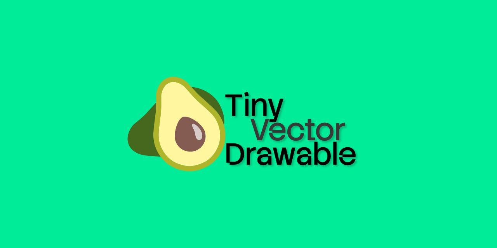

# Tiny Vector Drawable

_Your vector drawables, but make them tiny._



Shrink Android VectorDrawable and AnimatedVectorDrawable XML right in your browser. Drop an `.xml` file, get an optimized one back. Nothing gets uploaded.

Powered by [avocado](https://github.com/alexjlockwood/avocado) compiled for the browser. Visual result stays the same — just smaller and faster to parse.

## Quick start

1. Open the site (GitHub Pages or run locally).
2. Drag `.xml` vector drawable files onto the drop zone, or click to browse.
3. Pick pretty or minified output, then download.

## Run locally

```bash
make serve
```

Then open `http://127.0.0.1:5173` in your browser (or set `PORT`). A static server is required for ES modules and the service worker.

---

[Features & privacy](ABOUT.md) · [Build & architecture](DEVELOPMENT.md) · [MIT licensed](LICENSE)
